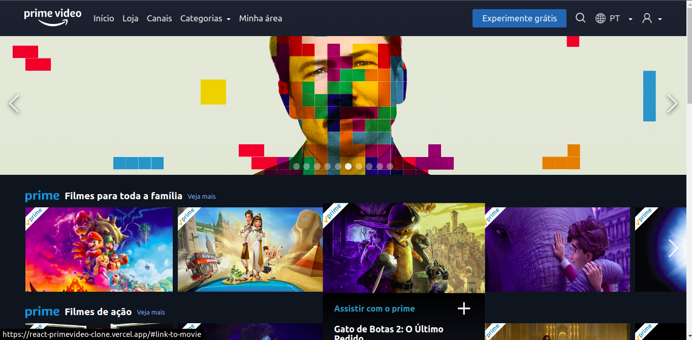

# React Primevideo Clone

Clone front-end do website do primevideo desenvolvido com ReactJS



---

## O que é

O projeto é uma aplicação front-end que visa replicar o layout e efeitos de interação do primevideo. Os dados de filmes exibidos são consumidos da API TheMovieDB

> :warning: Esse era o layout quando o projeto foi desenvolvido e atualmente o site da primevideo passou por atualizações em seu design.

## Futuros passos e melhorias

O projeto foi desenvolvido antes da última atualização do primevideo e por falta de referências não está finalizado.

- Atualizar para a nova versão do primevideo
- Design responsivo para smartphones e tablets
- Adicionar funcionalidades dos elementos do Header (Categorias, Linguagem, Perfil)
- Substituir o seletor :has por uma forma suportada pelo navegador Firefox

## Tecnologias utilizadas

- TheMovieDB API
- ReactJS
- CSS Modules
- React Icons
- Custom Hooks

## Como executar o projeto

:exclamation: A barra de pesquisa não funciona no navegador *Firefox*. Foi utilizado o seletor css :has que não é suportado pelo firefox. Uma forma alternativa será implementada futuramente :exclamation:

Faça o clone do repositório

```
git clone git@github.com:santanajoao/react-prime-video-clone.git
```

Acesse o diretório do projeto e instale as dependências:

```
npm install
```

Insira sua KEY da API TheMovieDB na linha um do arquivo `src/services/movies.js`:

```
// Substitua o texto dentro dos parenteses por sua chave
const API_KEY = 'YOUR_API_KEY'
```
<details>
  <summary>Não tem uma chave da API?</summary>
  <pre>
1. Acesse o site da API
2. Crie uma conta cliando em "Junte-se ao TMDB"
3. Faça login na sua conta
4. No canto superior direito clique no seu perfil > "Configurações"
5. No menu lateral clique em "API"
6. Clique no link que aparecerá para gerar sua KEY
  </pre>
</details>

Inicie o servidor de desenvolvimento:

```
npm run dev
```

Agora é só acessar o link do servidor local que é exibido no terminal ou apertar a tecla `o`!
